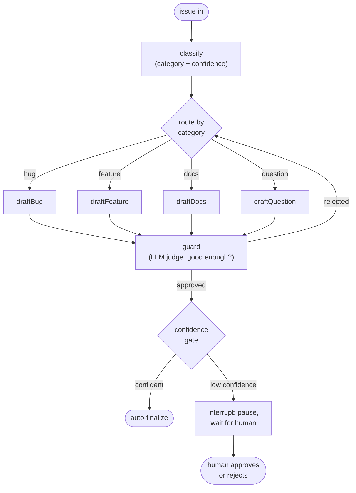

# issuegraph

A GitHub issue triage agent built on **LangGraph**, traced and evaluated with **LangSmith**.

Feed it a public GitHub issue URL. A state graph classifies the issue, routes it to a specialist draft node, quality-checks the draft in a bounded loop, then applies a confidence gate: high-confidence results finalize automatically while low-confidence results pause the graph and wait for human approval.

## How it works



The pieces map one-to-one onto LangGraph concepts:

| Concept | Where |
|---|---|
| Shared state (channels + reducers) | [`src/state.ts`](src/state.ts) |
| Nodes (classify, four specialist drafters, guard) | [`src/nodes.ts`](src/nodes.ts) |
| Conditional edges (category routing, guard retry loop) | [`src/graph.ts`](src/graph.ts) |
| Human-in-the-loop (`interrupt()` + `Command({ resume })`) | [`src/graph.ts`](src/graph.ts) |
| LangChain classifier chain (prompt piped into structured output) | [`src/classify.ts`](src/classify.ts) |

The classifier and guard force structured output through Zod schemas, so every LLM boundary returns typed, validated data. The redraft loop is bounded (`MAX_REDRAFTS`) and the confidence gate threshold is configurable (`CONFIDENCE_GATE` env var, default 0.75).

## Evals

The eval suite ([`src/run-evals.ts`](src/run-evals.ts)) uploads a labeled golden set to LangSmith, runs the full graph over every example with `evaluate()`, and scores each result two ways:

- **`category_accuracy`**: deterministic exact match against the labeled category.
- **`draft_quality`**: LLM-as-judge grading of the drafted reply, since free-form text has no single correct answer.

It then computes a **calibration report** from the classifier's stated confidences: a Brier score plus a reliability table comparing claimed confidence against actual accuracy per bucket ([`src/calibration.ts`](src/calibration.ts)). Confidence numbers from a model are claims, not facts. Calibration is how you check the claims.

```
── CALIBRATION REPORT ──────────────────────────────────
samples:      8
Brier score:  0.003  (0 = perfect, 0.25 = coin flip)

reliability by confidence bucket:
  bucket      n   claimed  actual   verdict
  0.9-1.0     8   0.95     1.00    calibrated
```

## Stack

- [`@langchain/langgraph`](https://github.com/langchain-ai/langgraphjs): the state machine (nodes, conditional edges, cycles, checkpointing, interrupts)
- [`@langchain/anthropic`](https://github.com/langchain-ai/langchainjs): Claude powers the classifier, drafters, guard, and judge
- [`langsmith`](https://github.com/langchain-ai/langsmith-sdk): tracing, datasets, offline evals
- TypeScript strict, Zod at every LLM boundary, Vitest

## Setup

```sh
pnpm install
cp .env.example .env   # ANTHROPIC_API_KEY + LANGSMITH_API_KEY
npx tsx src/hello-trace.ts   # smoke test: one traced model call
```

## Usage

```sh
pnpm triage <github-issue-url>   # triage one issue end-to-end
pnpm eval                        # golden set + calibration report
pnpm test                        # unit tests
```

MIT
